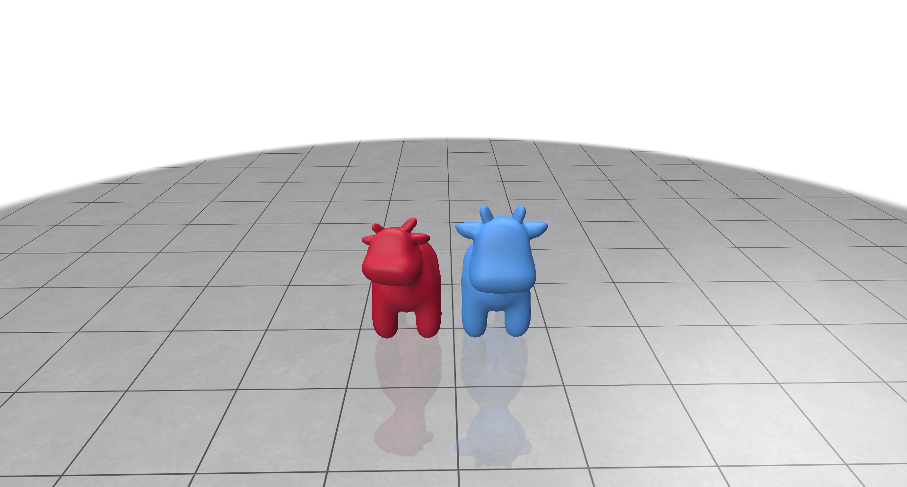

# SimpleGP

Implementation of [Iterative Closest Point](https://en.wikipedia.org/wiki/Iterative_closest_point) and [Laplacian Mesh Editing](https://people.eecs.berkeley.edu/~jrs/meshpapers/SCOLARS.pdf) in Python.

## Iterative Closest Point
<figure>
  <div style="display: flex; justify-content: center">
    
  </div>
</figure>

Iterative closest point algorithm is used in point cloud registration to merge multiple point clouds together. It works by finding out pairwise corrospondences between source and target point cloud and finding out the transformation such that $\sum_{i=0}^n(x_i - \mathrm{Rt}y_i)$ is minimum. This repository implements ICP using SVD, point to point least squares and point to plane least squares. A comparison of the time taken by each of the methods is given below.

### Benchmarks
<table class="tg" style="undefined;table-layout: fixed; width: 668px">
<colgroup>
<col style="width: 74px">
<col style="width: 106px">
<col style="width: 94px">
<col style="width: 104px">
<col style="width: 94px">
<col style="width: 103px">
<col style="width: 93px">
</colgroup>
<thead>
  <tr>
    <th class="tg-fymr"># Points</th>
    <th class="tg-fymr" colspan="2">SVD</th>
    <th class="tg-fymr" colspan="2">Point to Point</th>
    <th class="tg-fymr" colspan="2">Point to Plane</th>
  </tr>
</thead>
<tbody>
  <tr>
    <td class="tg-z1fk">Time</td>
    <td class="tg-z1fk">w/o KD-Tree</td>
    <td class="tg-z1fk">w/ KD-Tree</td>
    <td class="tg-z1fk">w/o KD-Tree</td>
    <td class="tg-z1fk">w/ KD-Tree</td>
    <td class="tg-z1fk">w/o KD-Tree</td>
    <td class="tg-z1fk">w/ KD-Tree</td>
  </tr>
  <tr>
    <td class="tg-0pky">100</td>
    <td class="tg-0pky">0.005</td>
    <td class="tg-0pky">0.004</td>
    <td class="tg-0pky">1.42</td>
    <td class="tg-0pky">1.46</td>
    <td class="tg-0pky">0.054</td>
    <td class="tg-0pky">0.056</td>
  </tr>
  <tr>
    <td class="tg-pcvp">1000</td>
    <td class="tg-pcvp">0.179</td>
    <td class="tg-pcvp">0.029</td>
    <td class="tg-pcvp">8.245</td>
    <td class="tg-pcvp">8.091</td>
    <td class="tg-pcvp">0.453</td>
    <td class="tg-pcvp">0.060</td>
  </tr>
  <tr>
    <td class="tg-0pky">10000</td>
    <td class="tg-0pky">24.18</td>
    <td class="tg-0pky">0.768</td>
    <td class="tg-0pky">171.0</td>
    <td class="tg-0pky">224.5</td>
    <td class="tg-0pky">21.48</td>
    <td class="tg-0pky">5.535</td>
  </tr>
</tbody>
</table>

#### Note
The benchmarks above are only run for a single point cloud. Ideally they should be run on a large number of point clouds to better understand the runtime and limitation of different methods.

### Usage
```bash
❯ python icp.py  --help
usage: icp.py [-h] [--file FILE] [--kd_tree] [--algorithm {svd,lsqr_point,lsqr_plane}] [--iters ITERS]

options:
  -h, --help            show this help message and exit
  --file FILE
  --kd_tree
  --algorithm {svd,lsqr_point,lsqr_plane}
  --iters ITERS
```
## Laplacian Mesh Editing
<figure>
  <div style="display: flex; justify-content: center">
    
  </div>
</figure>

Laplacian mesh editing is a commonly used method for deforming meshes naturaly by defining regions of interest and moving a handle to transfrom all the vertices in the ROI.

### Usage
```bash
❯ python laplacian_mesh_editing.py  --help
usage: laplacian_mesh_editing.py [-h] [--file FILE] [--boundary_file BOUNDARY_FILE] [--handle_idx HANDLE_IDX] [--handle_delta HANDLE_DELTA HANDLE_DELTA HANDLE_DELTA]

options:
  -h, --help            show this help message and exit
  --file FILE
  --boundary_file BOUNDARY_FILE
  --handle_idx HANDLE_IDX
  --handle_delta HANDLE_DELTA HANDLE_DELTA HANDLE_DELTA
```

## Acknowledgements
The Spot cow model was taken from Keenan Crane's [3D model repository](https://www.cs.cmu.edu/~kmcrane/Projects/ModelRepository/)
